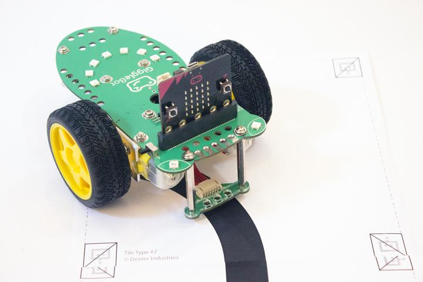

## GiggleBot MicroPython for the BBC Micro:bit 
[](https://travis-ci.org/RobertLucian/micropython-gigglebot)
[](https://gigglebot-dev.readthedocs.io/en/develop/?badge=develop)

This is the source code for MicroPython that's running on the BBC micro:bit + GiggleBot robot.

This firmware, when compared to https://github.com/bbcmicrobit/micropython, has libraries to support the collection of sensors that go on a GiggleBot. Also, there are a couple of features enabled that allow the use of pre-compiled modules on the microbit and others that permit the better use of the memory.



## Building It

Running the following commands are enough to build the firmware.
```bash
docker image build -t gigglebot-micropython src
docker container run --name gigglebot gigglebot-micropython
docker container cp gigglebot:/src/gupy/build/firmware.hex build/
docker container cp gigglebot:/src/tmp/ build/
```

This can take up to 5-8 minutes to finish so go grab a coffee. 

When it's done, a `firmware.hex` will show up in `build` directory. In the `build` directory there's also going to be a `tmp` directory containing `mpy` and `py` files of the libraries that get compiled into the firmware.

The last thing to do is to copy paste the `firmware.hex` to the microbit. 