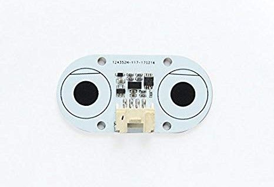
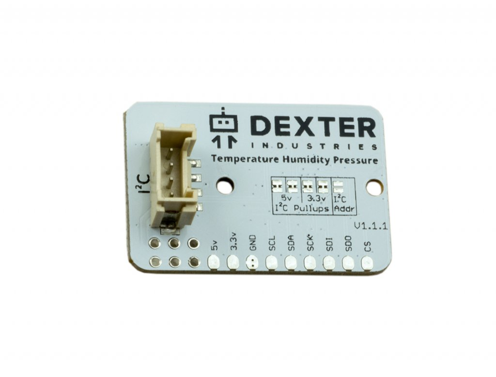
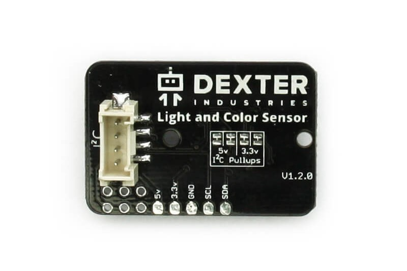

####
API
####

Time for reading the `GiggleBot`_ modules' API.

.. image:: https://media.giphy.com/media/3ov9jNziFTMfzSumAw/giphy.gif

**************************
GiggleBot - Regular Module
**************************

The :py:mod:`gigglebot` module should be the go-to module when playing around with the `GiggleBot`_. 
That's why this is the first module that gets documented in this chapter.

.. automodule:: gigglebot
   :members:

***************
Distance Sensor
***************

As you can see here, the `Distance Sensor`_ is the same sensor used on the `GoPiGo3`_ and on any DexterIndustries
board that we support and that has a Grove port with an `I2C` interface on it.

Because of this, we've spend lots of time trying to make the following API of the `Distance Sensor`_ identical to the one in the DI-Sensors documentation :py:class:`di_sensors.distance_sensor.DistanceSensor`,
so that the transition from either platform can be as seamless as possible.

.. automodule:: distance_sensor
   :members:
   :special-members:
   :exclude-members: __weakref__

************************************
Temperature Humidity Pressure Sensor
************************************

Just like with the `Distance Sensor`_, the `Temperature Humidity Pressure Sensor`_ is the same sensor used on the `GoPiGo3`_ 
and on any other board that we support.

As a consequence, we tried making the API of the `Temperature Humidity Pressure Sensor`_ similar to the one in the DI-Sensors documentation
:py:class:`di_sensors.temp_hum_press.TempHumPress`, so that the transition from either platform can be as seamless as possible.

.. automodule:: thp
    :members:
    :special-members:
    :exclude-members: __weakref__

************************************
Light and Color Sensor
************************************

.. automodule:: lightcolor
    :members: LightColorSensor, known_colors, known_hsv
    :special-members:
    :exclude-members: __weakref__

The above colors were picked from the following color wheel - there are a total of 12 colors hand-picked. 
All the codenames for these colors are to be found as keys in :py:attr:`~lightcolor.known_colors` and :py:attr:`~lightcolor.known_hsv` dictionaries.

In the following context, the numbers encompassing the wheel represent the **Hue** of the color. You can go on and read more about **Hue** and other
characteristics of HSV format `here <http://learn.leighcotnoir.com/artspeak/elements-color/hue-value-saturation/>`__.

.. note::
    If you want to come up with your own colour boundaries, 
    check this thread `here <http://answers.opencv.org/question/134248/how-to-define-the-lower-and-upper-range-of-a-color/?answer=134284#post-id-134284>`__.

.. image:: _static/images/ColorWheel.jpg
    :scale: 45
    :align: left

.. currentmodule:: lightcolor

.. autofunction:: translate_to_hsv
.. autofunction:: guess_color_hsv

***************************
GiggleBot - Advanced Module
***************************

.. automodule:: gigglebot_advanced
   :members:
   :special-members:
   :exclude-members: __weakref__

.. _gigglebot: https://www.gigglebot.io/
.. _gopigo3: https://www.dexterindustries.com/gopigo3/
.. _distance sensor:  https://www.gigglebot.io/collections/frontpage/products/distance-sensor
.. _temperature humidity pressure sensor: https://www.dexterindustries.com/shop/temperature-humidity-pressure-sensor/
.. _light and color sensor: https://www.dexterindustries.com/shop/light-color-sensor/