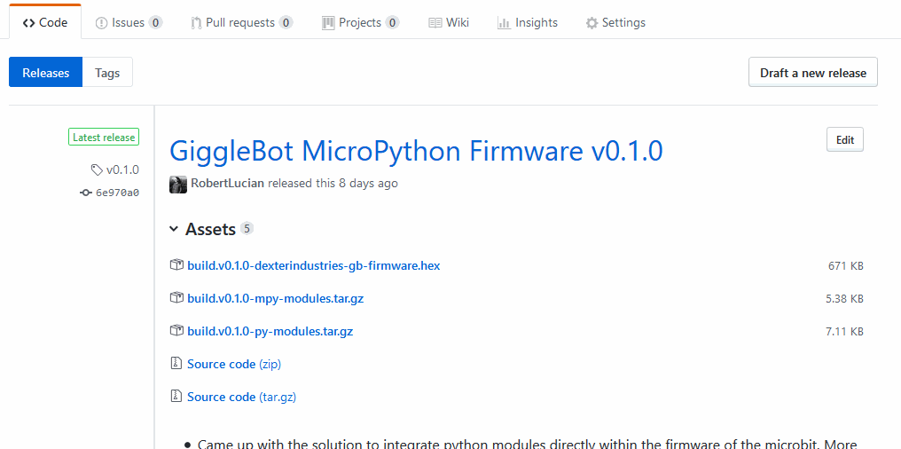
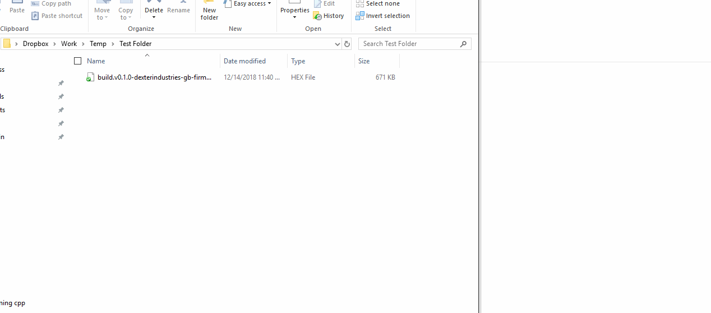
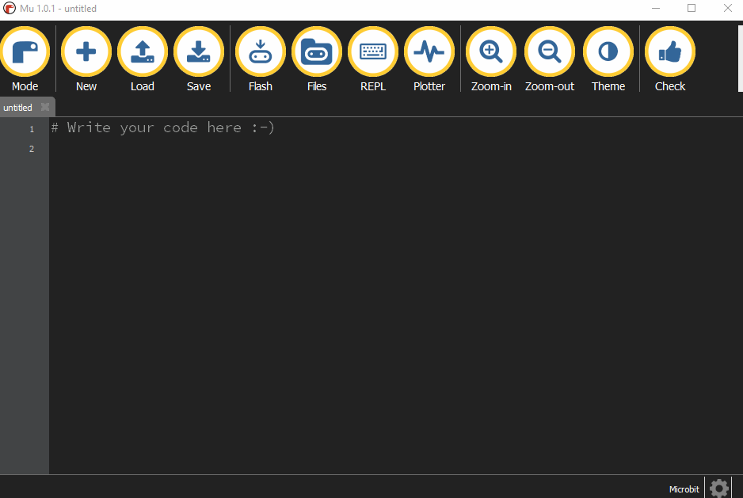

.. _getting-started:

###################
Getting Started
###################

The GiggleBot MicroPython library contains the following modules:

* :py:mod:`gigglebot` - contains an API to interface with the actual `GiggleBot`_: think motors, line sensor, light sensors, LEDs, servos, etc.
* :py:mod:`gigglebot_advanced`- still an API to interface with the `GiggleBot`_, but slightly more advanced and useful for debugging purposes.
* :py:mod:`distance_sensor` - add-on sensor library for the `Distance Sensor`_.

Each new release comes with the following artifacts:

* A customized BBC micro:bit firmware that includes all the above modules in it.
* The minified modules. These modules were minified to take less space on the BBC micro:bit.
* The pre-compiled modules (bytecodes) that no longer need to be compiled when they get imported on the BBC micro:bit.
* And the modules in their natural state.

******************
About the Firmware
******************

This customized firmware that includes the modules listed in this documentation also includes a handful of features meant to make use
of the available RAM on the BBC micro:bit in a more efficient manner. 

The vanilla firmware that comes with the `Mu Editor`_ is not really a good choice to use with external libraries because you cannot load precompiled
modules and then just import them. And loading most of the bigger libraries on the microbit doesn't work either, because the board has such limited RAM resources.

So we have come up with a custom firmware that allows the import of precompiled python modules (to byte-code aka ``.mpy`` files). These ``.mpy`` modules can be treated
like regular ``.py`` modules and copied in exactly the same manner over your microbit's filesystem, but they cannot be opened and edited in any way; it's not like it's necessary anyway.
This has the advantage of skipping the precompiling phase on the microbit that could leave it without RAM resources during or after this process. 

Still, precompiling modules still uses RAM to load them when they get imported, so the best bet is to just incorporate them into the firmware - a process called *freezing*. 
And this is what we have done with our firmware. Freezing the modules leads to a small usage of RAM, which is critical to the microbit, given its limited resources.

Here's a table showing what kind of modules the **GiggleBot firmware** (which is just a custom MicroPython version for the micro:bit) accepts vs the **regular firmware**:

+----------------------------+------------------------+-----------------------+
|                            | GiggleBot Firmware     | Regular Micropython   |
|                            |                        | For The Microbit      |
+============================+========================+=======================+
|regular ``.py`` modules     |          yes           |          yes          |
+----------------------------+------------------------+-----------------------+
|precompiled ``.mpy`` modules|          yes           |          no           |
+----------------------------+------------------------+-----------------------+
|freezed gigglebot           |                        |                       |
|modules                     |          yes           |          no           |
|                            |                        |                       |
+----------------------------+------------------------+-----------------------+

And here's what kind of modules can be used on the `BBC microbit`_ hardware:

+-------------------------------+------------------------+-----------------------+--------------------+
|          Module               | Load ``.py`` module    | Load ``.mpy`` module  | As freezed module  |
|                               |                        |                       |                    |
+===============================+========================+=======================+====================+
|:py:mod:`gigglebot`            |          yes           |          yes          |         yes        |
+-------------------------------+------------------------+-----------------------+--------------------+
|:py:mod:`gigglebot_advanced`   |          yes           |          yes          |         yes        |
+-------------------------------+------------------------+-----------------------+--------------------+
|:py:mod:`distance_sensor`      |                        |                       |                    |
|                               |          no            |          no           |         yes        |
|                               |                        |                       |                    |
+-------------------------------+------------------------+-----------------------+--------------------+

.. note::
    Be advised that loading ``.py`` modules directly to the microbit uses most of the RAM that's available to the board,
    so not much is left to the user to code. That's why it's better to go with ``.mpy`` or freezed modules (*meaning our custom firmware*) and only go with
    the regular ``.py`` when burning the custom GiggleBot MicroPython firmware to the microbit is not possible.

************************
Downloading the Firmware
************************

To download the GiggleBot firmware corresponding to a custom version of the documentation, note the version tag of the documentation,
then head over to this project's `release page <https://github.com/RobertLucian/micropython-gigglebot/releases>`_ and download the firmware with the respective tag.

As of this moment, this is the `latest release <https://github.com/RobertLucian/micropython-gigglebot/releases/latest>`_.

Apart from being able to download the firmware, the ``.py`` and ``.mpy`` modules can also be downloaded. Check the above tables to see where and which modules can be used.

*************************
Flashing the Firmware
*************************

Flashing the firmware is a breeze. Connect the `BBC microbit`_ to your laptop, wait until the *MICROBIT* filesystem appears and then copy-paste the GiggleBot firmware you just
downloaded to the microbit.

After flashing the firmware, you will be able to import all modules listed in this documentation.

********************************
Custom Firmware in the Mu Editor
********************************

The `Mu Editor`_ comes with a default firmware for the microbit that can be overridden with the GiggleBot firmware instead.
All that has to be done is to press on the *gear wheel* on the right hand side of the editor, then go to *BBC micro:bit Settings* and lastly,
copy paste the path to the custom firmware (or runtime as the Mu editor likes to call).

**************************
Upgrading DAPLink Firmware
**************************

There may be cases when `BBC microbit`_ fails to flash the firmware when the binary is dragged and dropped. This is generally caused by an old version of the DAPLink firmware.
This DAPLink firmware provides the USB interface that allows you to drag-and-drop binaries onto the target microcontroller (the microbit).

This DAPLink firmware can be easily upgraded. Just go over `this short tutorial <https://www.mbed.com/en/platform/hardware/prototyping-production/daplink/daplink-on-kl26z/>`_ to upgrade it.

.. _gigglebot: https://www.gigglebot.io/
.. _distance sensor:  https://www.gigglebot.io/collections/frontpage/products/distance-sensor
.. _mu editor: https://codewith.mu/en/
.. _bbc microbit: https://microbit.org/
